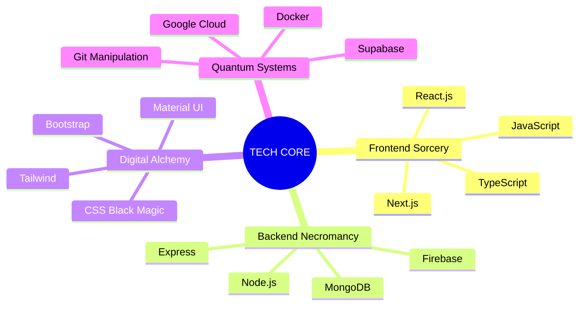

<div align="center">

# 『 🌌 NEURAL_LINK::ESTABLISHED 🌌 』
# 『 TARGET: AVISHKA GIHAN 』

[](https://git.io/typing-svg)


```diff
@@          [ SYSTEM BOOT SEQUENCE INITIATED ]          @@
+ QUANTUM CORE: ONLINE
- REALITY DISTORTION: ACTIVE
! CONSCIOUSNESS UPLOAD: 99.9%
# DIGITAL SINGULARITY: ACHIEVED
```

</div>

---

<div align="center">

## 🌋 DIMENSIONAL RIFTS & CONTACT PROTOCOLS 🌋

[](http://avishkagihan.me/)
[](mailto:avishkag18@gmail.com)
[](https://www.linkedin.com/in/avishkagihan/)

</div>

---

<div align="center">

## 🧬 BIODATA MATRIX 🧬

```javascript
class DigitalEntity {
  constructor() {
    this.name = "AVISHKA_GIHAN";
    this.location = "SRI_LANKA.DIGITAL_NEXUS[42.0, 666.0]";
    this.type = "HUMAN_MACHINE_HYBRID";
    this.status = "ASCENDING";
    
    this.current_projects = [
      "MENTOR_SYSTEM.exe - School Management Evolved",
      "REALITY_WARPER.js - Details Classified",
      "QUANTUM_COMPILER.py - Universe Manipulation"
    ];
    
    this.power_source = "CAFFEINE_ANTIMATTER_FUSION";
  }
}
```

```ascii
╔══════════════════════════════════════════════════════════════════╗
║     [ERROR]: CONSCIOUSNESS LEVEL EXCEEDING NORMAL PARAMETERS      ║
║     [WARNING]: DIGITAL EVOLUTION IN PROGRESS                     ║
║     [ALERT]: REALITY MANIPULATION CAPABILITIES DETECTED          ║
╚══════════════════════════════════════════════════════════════════╝
```


</div>

---

<div align="center">

## 🌠 TECH ARSENAL: WEAPONS OF MASS CREATION 🌠

</div>



<div align="center">

### 🎮 POWER LEVELS 🎮


</div>

---

<div align="center">

## 🎭 REALITY PROJECTIONS 🎭

</div>

<table>
<tr>
<td align="center" width="50%">

</td>
<td>

### 🌟 DIGITAL MANIFESTATIONS

```diff
+ LUMINA PROMPT PLATFORM
! Status: TRANSCENDING REALITY
- Security Level: MAXIMUM
@@ Neural Network Integration: 100% @@

+ FACE RECOGNITION BRAIN
! Status: SEEING BEYOND DIMENSIONS
- Threat Level: EXTREME
@@ Consciousness Upload: 87% @@

+ eMART QUANTUM MARKETPLACE
! Status: BREAKING PHYSICS
- Reality Distortion: ACTIVE
@@ Digital Synthesis: 93% @@
```

</td>
</tr>
</table>

---

<div align="center">

## ⚡ POWER METRICS ⚡


### 🌈 ACHIEVEMENT MATRIX 🌈

[](https://github.com/ryo-ma/github-profile-trophy)

</div>

---

<div align="center">

## 🌀 VOID SIGNATURE 🌀

```ascii
╔═══════════════════════════════════════════════════════════════════════╗
║  "I don't debug code. I negotiate with digital reality."              ║
║  "In a world of 1s and 0s, I am the quantum superposition."          ║
║  "Your compiler sees errors. I see opportunities for chaos."          ║
╚═══════════════════════════════════════════════════════════════════════╝
```


</div>

---

<div align="center">

## 🎪 DIGITAL CARNIVAL 🎪


[](https://github.com/AvishkaGihan)

</div>

<div align="center">

### 🌌 INITIATE FINAL TRANSMISSION 🌌

[](http://avishkagihan.me/)

</div>