# 忍者 Developer: Avishka Gihan 
### *The Way of the Full Stack Shinobi* 🍥



> "In the shadows of the digital realm, I forge solutions with the precision of a blade and the speed of the wind. This is my nindo: the way of the Full Stack Shinobi!" 🌪️

## 🎴 Ninja Scroll of Power

```ascii
             ,/
           ,'/
         ,' /
       ,'  /_____,
     .'____    ,'    
          /  ,'
         / ,'
        /,'
       /'
```

## 🥷 Secret Ninja Registration
- **Ninja Rank**: Elite Full Stack Shadow Master
- **Hidden Village**: Kadawatha, Sri Lanka 🏯
- **Secret Scrolls**: Master of the MERN Technique
- **Current S-Rank Mission**: [Mentor School Management System](http://github.com/AvishkaGihan/mentor-app.git)
- **Ninja Academy**: NSBM University (Software Engineering)
- **Chakra Affinities**: 
  - Primary: MERN Stack Release
  - Secondary: Next.js Time-Space Manipulation

## 🔮 Forbidden Techniques in Training
- 🌀 Perfecting the Next.js Ultimate Rasengan
- 💫 Developing the Thousand Shadow Clone Deploy Technique
- ⚡ Mastering the Cloud Architecture Style: AWS Release
- 🔥 Studying Ancient TypeScript Scrolls
- 🌊 Docker Container Sealing Jutsu

## ⚔️ Battle-Tested Arsenal (Tech Stack)

### 🎭 Frontend Combat Techniques
<div align="center">

| Jutsu | Power Level | Special Ability |
|-------|-------------|-----------------|
| React | ⭐⭐⭐⭐⭐ | Shadow Clone Component Technique |
| Next.js | ⭐⭐⭐⭐ | Time-Space Navigation Release |
| TypeScript | ⭐⭐⭐⭐ | Type Safety Barrier Jutsu |
| Tailwind | ⭐⭐⭐⭐ | Styling Wind Release |

</div>

### 🐉 Backend Forbidden Arts
<div align="center">

| Jutsu | Power Level | Special Ability |
|-------|-------------|-----------------|
| Node.js | ⭐⭐⭐⭐⭐ | Async Event Loop Technique |
| MongoDB | ⭐⭐⭐⭐ | Document Sealing Jutsu |
| Express | ⭐⭐⭐⭐ | Route Handler Release |
| GraphQL | ⭐⭐⭐ | Query Resolution Technique |

</div>

## 🎯 Ninja Mission Stats

<div align="center">

```ascii
⚡ Mission Success Rate: 98.2%
🎯 Critical Bugs Eliminated: 1,337
⚔️ Pull Requests Merged: 421
🔥 Active Streak: 42 days
```


</div>

## 📜 Ancient Scrolls (Contact Methods)

<div align="center">

| Scroll Type | Summoning Technique |
|-------------|---------------------|
| 🌐 Portfolio | [Secret Archive](http://avishkagihan.me/) |
| 📫 Email | [Messenger Bird](mailto:avishkag18@gmail.com) |
| 💬 LinkedIn | [Alliance Network](https://www.linkedin.com/in/avishkagihan) |
| ⚔️ GitHub | [Code Repository](https://github.com/AvishkaGihan) |

</div>

## 🗝️ Secret Technique Repositories

<div align="center">

[](https://github.com/AvishkaGihan/mentor-app)

[](https://github.com/AvishkaGihan/lumina-prompt-platform)

</div>

---

<div align="center">

*"In the world of code, those who abandon clean architecture are scum, but those who abandon their codebase's maintainability are worse than scum!"*


```ascii
  ___________________________
 |                           |
 |    Available for Epic     |
 |    Coding Adventures!     |
 |___________________________|
        \   ^__^
         \  (oo)\_______
            (__)\       )\/\
                ||----w |
                ||     ||
```

</div>